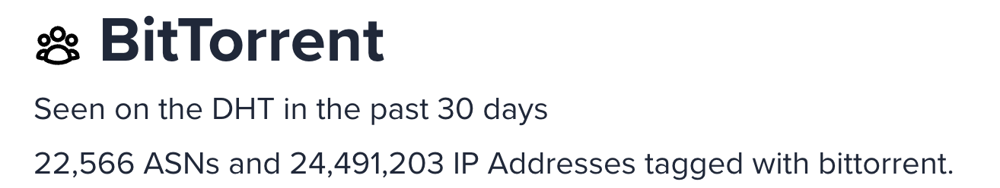
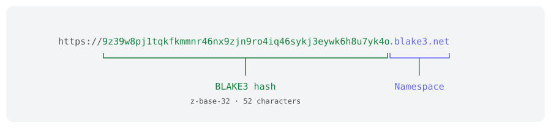
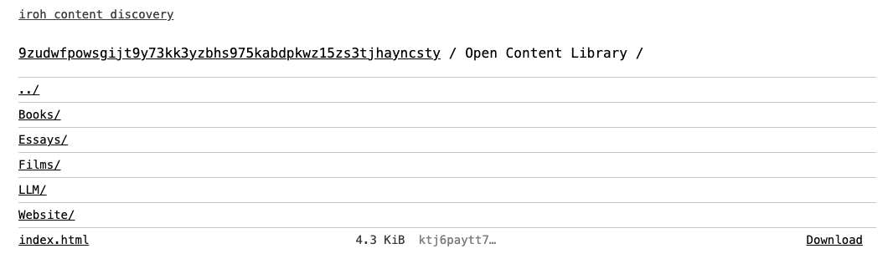
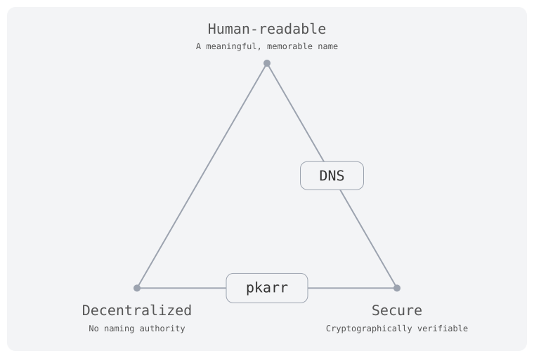

<!-- center -->

# iroh global content discovery

Rüdiger Klaehn

n0.computer

---

<!-- center -->

Publish a website, a blog post or a pamphlet, and have it stay available **globally** as long as **enough people care**.

---

# Learn from the best: BitTorrent

- It **just works**, and has for over two decades
- Transfer protocol and content discovery are **separate systems**
  - 2001: transfer protocol + centralized trackers
  - 2005: [Mainline DHT][bep-5]

---

# Transfer: BLAKE3 instead of SHA-1 pieces

- BitTorrent: `.torrent` file with one SHA-1 hash per piece
  - a piece can only be validated **after** downloading all of it
- [iroh-blobs][iroh-blobs]: [BLAKE3 verified streaming][bao]
  - a **single root hash**, no piece length, no piece hashes
  - validate any range while it streams in

---

# Mainline DHT: `announce_peer` / `get_peers`

---

# Mainline: extreme minimalism

- Every query and response fits in a **single UDP packet**
- A provider record is just `host:port` **as seen by the DHT node**
- Writes need a token: proof you can receive packets at that address
- Signed records ([BEP 44][bep-44]) are tiny and self-contained

Result: lookups in **well under a second**, often tens of ms

---

<!-- center -->

# Mainline is huge

---

# The problem

- Mainline provider records are an IPv4 `host:port`
- iroh dials by **key**: `EndpointId`
- That `host:port` is usually behind a NAT, so **not reachable**

We need: `host:port` → `EndpointId`

---

# [udp-addr-index][udp-addr-index]

- Tiny UDP service: live `host:port` → up to 1 KiB of metadata
- Single-packet protocol
  - writes need a reachability token
  - reads are padded against amplification
- Last writer wins, records expire, purely in memory
- Record: `EndpointId` + addr + timestamp, **signed** by the endpoint key
- Not iroh specific, would make a nice mainline extension

---

# Workflow

---

# Websites: content-addressed links

- **Browser plugin** rewrites to `<hash>.blake3.localhost:45475`
- **Local gateway** finds providers on mainline, downloads, verifies
- **One origin per hash** on `localhost`: content is isolated like separate websites

---

# Names: pkarr

- Permissionless DNS records for a keypair, published on mainline
- **Browser plugin** rewrites `<key>.pkarr.net` to `<key>.pkarr.localhost`
- **Local gateway** resolves the record **and** fetches the content
- Served as `<key>.pkarr.localhost`: one origin per name

---

# Why `<z32>.blake3.net`?

- The plugin needs a **hostname** to decide whether to redirect
- `https://<z32>.blake3.net/` is a **plain https URL**: works in every browser, autolinks, copy-paste
- The suffix says **what** it is: content hash (`blake3.net`) or public key (`pkarr.net`)
- Without the plugin, the link still lands on a domain we control

---

<!-- center -->

---

# Zooko's triangle

---

# Publishing

- *You* are the publisher: content and names need continuous announcing
- [iroh-share][iroh-share]: like [sendme][sendme], but as a daemon
- Mine runs on an old NAS in my attic, behind a NAT

---

# Far from perfect, but a start

- Mainline won't scale to *all content on the internet*
- Unencrypted, easy for middleboxes to block
- pkarr uses Ed25519: not post quantum
- **No privacy**: anybody can look up a provider's IP

We are in the *food and shelter* phase. The user interface stays stable while the system improves.

---

# Try it

- Gateway + plugin: [github.com/n0-computer/iroh-content-discovery][icd]
- Static content: [y7rmokt6...hto.blake3.net][try-blake3]
- pkarr name: [5ti57asz...u8y.pkarr.net][try-pkarr]
- What the links are: [blake3.net][blake3-net] and [pkarr.net][pkarr-net]
- Blog post: [iroh.computer/blog/iroh-global-content-discovery][post]

[bep-5]: https://www.bittorrent.org/beps/bep_0005.html
[bep-44]: https://www.bittorrent.org/beps/bep_0044.html
[iroh-blobs]: https://docs.iroh.computer/protocols/blobs
[bao]: https://github.com/oconnor663/bao#readme
[udp-addr-index]: https://github.com/n0-computer/iroh-content-discovery/tree/main/udp-addr-index
[iroh-share]: https://github.com/n0-computer/iroh-share/releases
[sendme]: https://www.iroh.computer/sendme
[icd]: https://github.com/n0-computer/iroh-content-discovery
[try-blake3]: https://y7rmokt6h5mryuauw83em4u1br6tqrukaw3ngtde7zp8p3bg6hto.blake3.net/
[try-pkarr]: https://5ti57aszf7kaicsncb4wgigkf9bju39kofiz8dthwdujkmz85u8y.pkarr.net/
[post]: https://www.iroh.computer/blog/iroh-global-content-discovery
[blake3-net]: https://blake3.net/
[pkarr-net]: https://pkarr.net/
